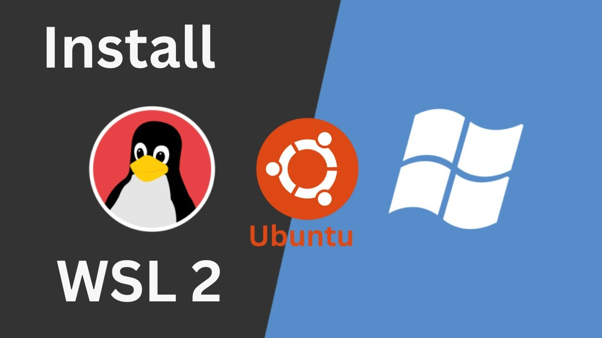

# [](https://git.io/typing-svg)

<div align="center">
   
</div>

### O que é o WSL?

O **WSL** (Windows Subsystem for Linux) é uma funcionalidade do Windows que permite rodar distribuições Linux diretamente no sistema operacional Windows, sem a necessidade de uma máquina virtual ou dual boot. O WSL oferece uma maneira de utilizar ferramentas e software de Linux em um ambiente nativo do Windows, proporcionando uma experiência mais fluida para desenvolvedores que precisam trabalhar com ambas as plataformas.

O WSL tem duas versões principais:
- **WSL 1**: A primeira versão, que implementa um kernel compatível com o Linux dentro do Windows, traduzindo as chamadas do sistema para o Windows.
- **WSL 2**: A versão mais recente, que usa um kernel completo do Linux em uma máquina virtual leve, oferecendo melhor desempenho, compatibilidade e suporte para mais ferramentas.

### Como Instalar o Ubuntu 22 no WSL (Windows Subsystem for Linux) no Windows

Aqui está um guia passo a passo para instalar o Ubuntu 22.04 LTS no seu Windows usando o WSL 2:

#### 1. Habilitar o WSL

1. **Abrir o PowerShell como Administrador**:
   - Clique com o botão direito no menu Iniciar e escolha **Windows PowerShell (Admin)**.

2. **Ativar o recurso WSL**:
   Digite o seguinte comando no PowerShell e pressione Enter:
   ```bash
   wsl --install
   ```
   Isso instala o WSL e o Ubuntu automaticamente se você estiver no Windows 10 ou 11 mais recentes. Se for necessário, reinicie o computador após a execução do comando.

   Se você estiver usando uma versão mais antiga do Windows 10, você pode precisar executar os comandos abaixo manualmente para ativar o WSL:
   ```bash
   dism.exe /online /enable-feature /featurename:Microsoft-Windows-Subsystem-Linux /all /norestart
   dism.exe /online /enable-feature /featurename:VirtualMachinePlatform /all /norestart
   ```

3. **Ativar o Hyper-V** (se ainda não estiver habilitado):
   O WSL 2 usa o Hyper-V para virtualização. Você pode ativar o Hyper-V com o comando:
   ```bash
   dism.exe /online /enable-feature /featurename:Microsoft-Hyper-V-All /all /norestart
   ```

4. **Reinicie o computador** depois de executar os comandos.

#### 2. Instalar o Ubuntu 22.04 LTS

1. **Abrir a Microsoft Store**:
   - Vá até a **Microsoft Store** (digite "Microsoft Store" na barra de pesquisa do Windows).

2. **Buscar pelo Ubuntu**:
   - Na loja, pesquise por "Ubuntu" e procure pela versão 22.04 LTS (ou a versão mais recente disponível).

3. **Instalar o Ubuntu**:
   - Clique na opção "Ubuntu 22.04 LTS" e depois em **Instalar**.

4. **Aguardar a instalação**:
   - O processo pode demorar alguns minutos. Após a instalação, clique em **Iniciar** para configurar o Ubuntu.

#### 3. Configurar o Ubuntu

1. **Primeiro lançamento do Ubuntu**:
   - Ao abrir o Ubuntu pela primeira vez, ele pedirá para configurar o seu nome de usuário e senha. Este será o usuário padrão para a sua sessão no Ubuntu.

2. **Atualizar os pacotes do Ubuntu**:
   - Após a instalação, é uma boa prática atualizar os pacotes. No terminal do Ubuntu, execute:
     ```bash
     sudo apt update && sudo apt upgrade
     ```

#### 4. Verificar e Definir o WSL 2 como Padrão

Se o Ubuntu não foi instalado diretamente com o WSL 2, você pode verificar a versão do WSL e garantir que o Ubuntu 22.04 LTS esteja rodando no WSL 2:

1. **Verificar a versão do WSL**:
   No PowerShell (ou no terminal do Ubuntu), execute o seguinte comando para ver a versão do WSL:
   ```bash
   wsl -l -v
   ```
   Isso irá listar todas as distribuições e a versão do WSL associada a elas.

2. **Mudar para WSL 2**:
   Se o Ubuntu 22.04 estiver utilizando o WSL 1, você pode alterá-lo para o WSL 2 com o seguinte comando:
   ```bash
   wsl --set-version Ubuntu-22.04 2
   ```

#### 5. Usando o Ubuntu no WSL

Após a instalação e configuração, você pode usar o Ubuntu no WSL da seguinte maneira:

- **Abrir o Ubuntu**: Basta procurar por "Ubuntu" no menu Iniciar e clicar no aplicativo para abrir o terminal do Ubuntu.
- **Usar o Ubuntu**: Agora você pode usar o terminal do Ubuntu normalmente, instalar pacotes, rodar comandos Linux, etc.

---

### Considerações Finais

O **WSL 2** oferece uma experiência muito próxima à de um sistema Linux nativo, com desempenho significativamente melhor do que o WSL 1, graças ao uso de um kernel Linux real. Além disso, a integração com o Windows permite utilizar ferramentas e aplicações de ambos os sistemas ao mesmo tempo.

Se você trabalha com desenvolvimento de software ou precisa de um ambiente de desenvolvimento Linux no Windows, o **Ubuntu 22 no WSL** é uma excelente escolha.

### Adicional !!!

[Instalar o oh-my-zsh](oh-my-zsh.md)